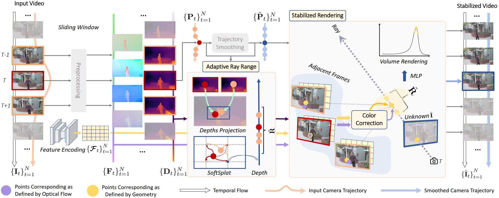

# 3D Multi-frame Fusion for Video Stabilization (CVPR 2024)


Code for the paper **3D Multi-frame Fusion for Video Stabilization**, CVPR 2024.

**Authors**: Zhan Peng, Xinyi Ye, Weiyue Zhao, Tianqi Liu, Huiqiang Sun, Baopu Li, Zhiguo Cao

[[paper]](https://openaccess.thecvf.com/content/CVPR2024/papers/Peng_3D_Multi-frame_Fusion_for_Video_Stabilization_CVPR_2024_paper.pdf) [[arxiv]](https://arxiv.org/abs/2404.12887) [[youtube]](https://www.youtube.com/watch?v=-dpI1CFcM7A)

## Introduction
In this paper, we present RStab, a novel framework for video stabilization that integrates 3D multi-frame fusion through volume rendering. Departing from conventional methods, we introduce a 3D multi-frame perspective to generate stabilized images, addressing the challenge of full-frame generation while preserving structure. The core of our RStab framework lies in Stabilized Rendering (SR), a volume rendering module, fusing multi-frame information in 3D space. Specifically, SR involves warping features and colors from multiple frames by projection, fusing them into descriptors to render the stabilized image. However, the precision of warped information depends on the projection accuracy, a factor significantly influenced by dynamic regions. In response, we introduce the Adaptive Ray Range (ARR) module to integrate depth priors, adaptively defining the sampling range for the projection process. Additionally, we propose Color Correction (CC) assisting geometric constraints with optical flow for accurate color aggregation. Thanks to the three modules, our RStab demonstrates superior performance compared with previous stabilizers in the field of view (FOV), image quality, and video stability across various datasets.
## Installation

### Requirements
* Python 3.10.0
* Pytorch 1.12.0
* CUDA 11.6

### Virtual Environment
```bash
conda create -n rstab python=3.10
conda activate rstab 
```

### Install RStab

(1) Clone the RStab repository.
```bash
git clone https://github.com/pzzz-cv/RStab.git --recursive
```

(2) Install the dependent libraries.
```bash
pip install torch==1.12.0+cu116 torchvision==0.13.0+cu116 torchaudio==0.12.0 --extra-index-url https://download.pytorch.org/whl/cu116
pip install -r requirements.txt
```

## Inference

(1) Preprocess with Deep3D.

For the official implementation, Deep3D is required. Then run:
```bash
cd Deep3D
python geometry_optimizer.py --video_path <path_to_video> --output_dir ../output/Deep3D --name <video_name>
cd ..
```

If you are interested in the stabilized results of Deep3D, you can run: 
```bash
python rectify.py --output_dir ../output/Deep3D --name  <video_name>
```

Results would look like:
```
output
└── Deep3D
    ├── video1
    │   ├── depths/
    │   ├── errors/
    │   ├── flows/
    │   ├── images/
    │   ├── output_images/
    │   ├── output.avi
    │   └── poses.npy
    ├── video2/
    └── ...
```

(2) Run RStab.

Create the environment, here we show an example using conda.
```bash
cd RStab
python rectify.py --expname <video_name>
cd ..
```

Results would look like:
```
output
├── Deep3D/
└── RStab
    ├── video1
    │   ├── video1_255000
    │   │   └── videos/
    │   └──video1.avi
    └── ...
```

To modify the network, simply edit the parameters in the configs/eval.txt:

* **`--height`:** Height of the input video.
* **`--width`:** Width of the input video.
* **`--chunk_size`:** Number of rays rendered. This parameter affects the GPU memory usage and increasing this parameter can speed up the model within feasible limits.
* **`--N_samples`:** Number of samples taken along each ray.
* **`--white_bkgd`:** Color of background.
* **`--neighbor_list`:** Rule for selecting neighboring frames.
* **`--preprocessing_model`:** Selection of the preprocessing model, optional: [MonST3R, Deep3D]..
* **`--sample_range_gain`:** Gain of the sampling range.
* **`--no_color_correction`:** Whether to use Color Correction.
           
You can customize the frame selection strategy as needed by adjust **`--neighbor_list`**, and we offer some reference options：
* 13 [-20,-15,-10,-3,-2, -1,0,1, 2,3,10,15,20]
* 7  [-5, -3, -1,0,1, 3, 5]
* 5  [-5, -3, 0, 3, 5]
* 3  [-3, 0, 3]
The more adjacent frames used, the higher the quality of the synthesized image, but the longer the computation time.

For generating stable trajectories, you can refer to and modify the smooth.py.

## Optional
In some extreme cases, Deep3D does not perform well, and MonST3R is recommended instead.

For installation and usage instructions of MonST3R, please refer to the official repository of [MonST3R](https://github.com/Junyi42/monst3r). Since the official project does not save the generated camera poses and depth estimates, we recommend using our provided code and setting up the environment according to the official requirements. 

We offer a simple guide to assist you with this process:

1.Create the environment, here we show an example using conda.

```bash
cd MonST3R
conda create -n monst3r python=3.11 cmake=3.14.0
conda activate monst3r 
conda install pytorch torchvision pytorch-cuda=12.1 -c pytorch -c nvidia  # use the correct version of cuda for your system
pip install -r requirements.txt
pip install -r requirements_optional.txt
```

2.Optional, compile the cuda kernels for RoPE (as in CroCo v2).

```bash
# DUST3R relies on RoPE positional embeddings for which you can compile some cuda kernels for faster runtime.
cd croco/models/curope/
python setup.py build_ext --inplace
cd ../../../
```

3.Run MonST3R.

```bash
cd MonST3R
python demo.py --input ../output/Deep3D/images  --output_dir ../output/MonST3R/<video_name>  --seq_name output
cd ..
```
Results would look like:
```
output
├── Deep3D/
└── MonST3R
    ├── video1
    │   ├── _depth_maps.gif
    │   ├── 00000.npy
    │   ├── ...(estimation of depth)
    │   ├── conf_0.npy
    │   ├── ...
    │   ├── dynamic_mask_0.png
    │   ├── ...
    │   ├── frame_0000.png
    │   ├── ...
    │   ├── init_conf_0.npy
    │   ├── ...
    │   ├── pred_intrinsics.txt
    │   ├── ...(intrinsics of camera)
    │   ├── pred_traj.txt（extrinsics of camera）
    │   ├── ...
    │   └── scene.glb
    ├── video2/
    └── ...
```


## Citation
If you find this work useful in your research, please cite:
```
@inproceedings{peng20243d,
  title={3D multi-frame fusion for video stabilization},
  author={Peng, Zhan and Ye, Xinyi and Zhao, Weiyue and Liu, Tianqi and Sun, Huiqiang and Li, Baopu and Cao, Zhiguo},
  booktitle={{IEEE/CVF} Conference on Computer Vision and Pattern Recognition,
                  {CVPR} 2024, Seattle, WA, USA, June 16-22, 2024},
  pages={7507--7516},
  year={2024},
  publisher={{IEEE}},
}
```

## Acknowledgement
This repo is built upon several repos, e.g.,  [IBRNet](https://github.com/googleinterns/IBRNet), [Deep3D](https://github.com/yaochih/Deep3D-Stabilizer-release) and [MonST3R](https://github.com/Junyi42/monst3r).

## Contact
If you have any questions or suggestions about this repo, please feel free to contact me (peng_zhan@hust.edu.cn).
